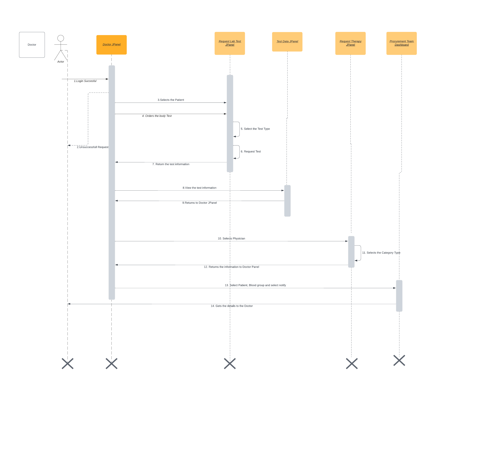

<h3>TITLE OF THE PROJECT</h3> 

**BLOOD MANAGEMENT SYSTEM**    

                                        ========================================
                                                     INTRODUCTION
                                        ========================================

 
**Team Members:**
- Varsha Reddy Kumbham - 002762752, kumbham.v@mortheastern.edu          ​                
- Sindhura Bandaru -002727624​ , bandaru.si@northeastern.edu         
- Sahithi Gaddam- 002766983​ , gaddam.sahi@northeastern.edu          

**Repo Link**
```bash
git@github.com:varshakumbham1/AED_Final_Project.git
```

                                        ========================================
                                                    UML DIAGRAMS
                                        ========================================

                                        

## Model Diagram


## Class Diagram


## Sequence Diagrams

1. Doctor



2. Physician


3. Physicist 


4. Health Officer


5. Event Organizer


6. Patient


7. Blood Finding Manager


7. System Admin


